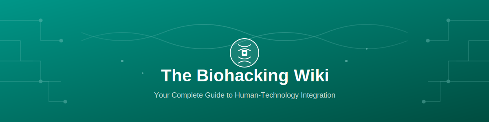
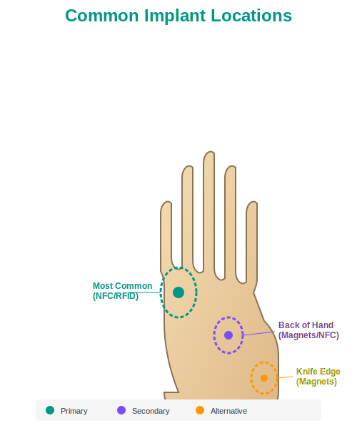
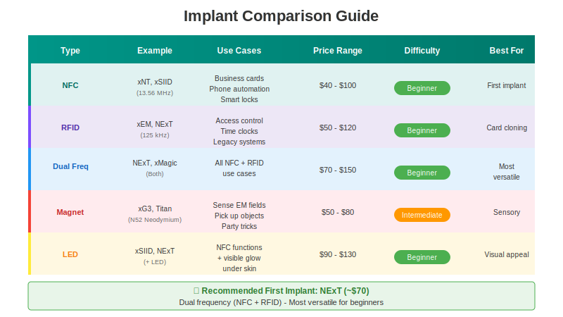
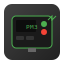
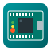

# 🧬 The Biohacking Wiki

<figure markdown="span">
  { .hero-banner }
</figure>

**Welcome to your complete guide to human-technology integration.** Whether you're completely new to biohacking or an experienced grinder, this wiki is your comprehensive resource for everything related to **implantable technology** and human augmentation.

---

## 🚀 Quick Start

📖
**[Getting Started](getting-started.md)**

Everything a beginner needs to know

Beginner

🏷️
**[Implants Guide](implants-guide.md)**

Learn about all implant types

All Levels

⚠️
**[Safety & Legal](safety-and-legal.md)**

Critical safety information

Required

🛠️
**[Tools & Equipment](tools-and-equipment.md)**

What you need to get started

Intermediate

---

## 🏷️ Implant Types

**NFC**

**RFID**

**Magnet**

**LED**

### Implant Placement Guide

<figure markdown="span">
  { .center-image width="400" }
  <figcaption>Common implant locations in the hand</figcaption>
</figure>

---

## 📊 Implant Comparison

<figure markdown="span">
  { .center-image }
  <figcaption>Compare different implant types at a glance</figcaption>
</figure>

### ⭐ Recommended First Implant: NExT (~$70)

- **Dual frequency** (NFC + RFID) - Most versatile
- Can clone access cards AND share URLs
- Great community support
- Easy to program with smartphone

**Find an installer:** [dangerousthings.com/partners](https://dangerousthings.com/partners/)

---

## 🗺️ Learning Path

<figure markdown="span">
  { .center-image }
  <figcaption>Your journey from beginner to biohacker</figcaption>
</figure>

---

## 🎥 Learn More

  <iframe src="https://www.youtube-nocookie.com/embed/7DxVWhFLI6E" title="Biohacking Introduction" frameborder="0" allow="accelerometer; autoplay; clipboard-write; encrypted-media; gyroscope; picture-in-picture" allowfullscreen></iframe>

*Video: An introduction to biohacking and human augmentation technology.*

---

## 📚 Wiki Contents

### Core Guides

| Guide | Description | Audience |
|-------|-------------|----------|
| 📖 **[Getting Started](getting-started.md)** | Complete beginner's introduction to biohacking | Newcomers |
| 🏷️ **[Implants Guide](implants-guide.md)** | Comprehensive guide to all implant types | All levels |
| 🛠️ **[Tools & Equipment](tools-and-equipment.md)** | Hardware and software for biohacking | Intermediate |
| 🔨 **[DIY Projects](diy-projects.md)** | Practical projects to build | Intermediate |
| ⚠️ **[Safety & Legal](safety-and-legal.md)** | Critical safety and legal information | Required |
| 📖 **[Glossary](glossary.md)** | Definitions of biohacking terms | All levels |
| 🔗 **[Resources](resources.md)** | Links, communities, and further reading | All levels |

### Special Topics

| Topic | Description |
|-------|-------------|
| 🏴‍☠️ **[PegLeg Project](pegleg/index.md)** | Implantable Raspberry Pi documentation |
| 📜 **[Biohacking History](biohacking-history.md)** | Timeline and key figures |
| 📁 **[Technical Files](implant-tech-files/index.md)** | Commands, notes, and configurations |

---

## 🔧 Essential Tools

**Proxmark3**
RFID Research

**Arduino**
DIY Projects

---

## 🌐 Community & Resources

### Join the Conversation

| Platform | Link | Purpose |
|----------|------|---------|
| **Dangerous Things Forum** | [forum.dangerousthings.com](https://forum.dangerousthings.com) | Main community hub |
| **Reddit** | [r/biohackers](https://reddit.com/r/biohackers) | General discussions |
| **Biohack.me** | [biohack.me](https://biohack.me) | Wiki and forums |

### Essential Links

| Resource | Link |
|----------|------|
| **Buy Implants** | [Dangerous Things](https://dangerousthings.com) |
| **Find Installers** | [Partner Map](https://dangerousthings.com/partners/) |
| **Proxmark3 Software** | [GitHub](https://github.com/RfidResearchGroup/proxmark3) |
| **PegLeg Project** | [pegleg.org](https://www.pegleg.org/) |

---

## 🤝 Contributing

This wiki is a community resource. Contributions are welcome!

**Ways to help:**

- 📝 Fix errors or add clarifications
- 🔗 Add new resources and links
- 📚 Write new guides or tutorials
- 🌐 Translate content
- 🐛 Report issues

See [Resources](resources.md#contributing-to-this-wiki) for contribution guidelines or check out our [Contributing Guidelines](https://github.com/J9ck/biohacking-wiki/blob/main/CONTRIBUTING.md).

---

   
  
  
  
    
  <i>"The best interface is no interface at all."</i>
    
  <strong>⚠️ Always prioritize safety. Research thoroughly before any procedure. ⚠️</strong>

